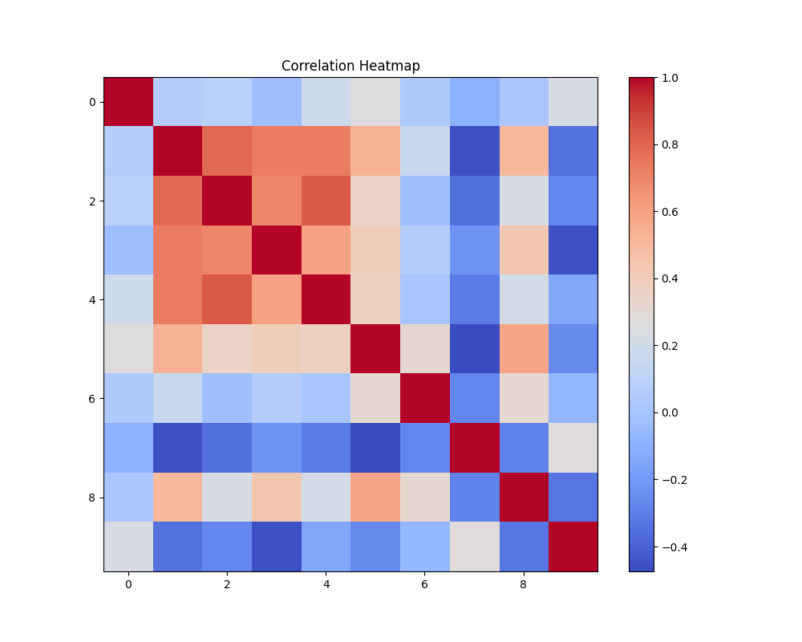

# Dataset Analysis

## Dataset Overview
This analysis is based on the provided dataset. It includes details such as:
- Column names and types: {"Country name": "object", "year": "int64", "Life Ladder": "float64", "Log GDP per capita": "float64", "Social support": "float64", "Healthy life expectancy at birth": "float64", "Freedom to make life choices": "float64", "Generosity": "float64", "Perceptions of corruption": "float64", "Positive affect": "float64", "Negative affect": "float64"}
- Missing values summary: {"Country name": 0, "year": 0, "Life Ladder": 0, "Log GDP per capita": 28, "Social support": 13, "Healthy life expectancy at birth": 63, "Freedom to make life choices": 36, "Generosity": 81, "Perceptions of corruption": 125, "Positive affect": 24, "Negative affect": 16}

## Key Findings
Error obtaining insights from LLM: 

You tried to access openai.ChatCompletion, but this is no longer supported in openai>=1.0.0 - see the README at https://github.com/openai/openai-python for the API.

You can run `openai migrate` to automatically upgrade your codebase to use the 1.0.0 interface. 

Alternatively, you can pin your installation to the old version, e.g. `pip install openai==0.28`

A detailed migration guide is available here: https://github.com/openai/openai-python/discussions/742

## Visualizations
### Correlation Heatmap

