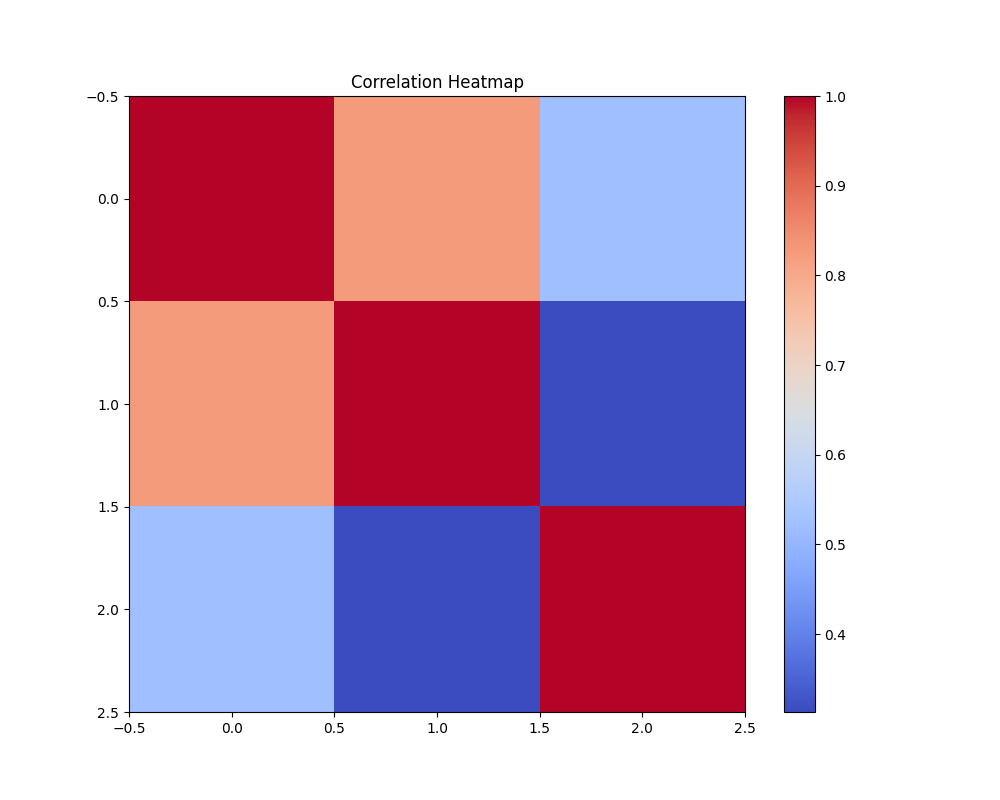

# Dataset Analysis

## Dataset Overview
This analysis is based on the provided dataset. It includes details such as:
- Column names and types: {"date": "object", "language": "object", "type": "object", "title": "object", "by": "object", "overall": "int64", "quality": "int64", "repeatability": "int64"}
- Missing values summary: {"date": 99, "language": 0, "type": 0, "title": 0, "by": 262, "overall": 0, "quality": 0, "repeatability": 0}

## Key Findings
Error obtaining insights from LLM: 

You tried to access openai.ChatCompletion, but this is no longer supported in openai>=1.0.0 - see the README at https://github.com/openai/openai-python for the API.

You can run `openai migrate` to automatically upgrade your codebase to use the 1.0.0 interface. 

Alternatively, you can pin your installation to the old version, e.g. `pip install openai==0.28`

A detailed migration guide is available here: https://github.com/openai/openai-python/discussions/742

## Visualizations
### Correlation Heatmap

